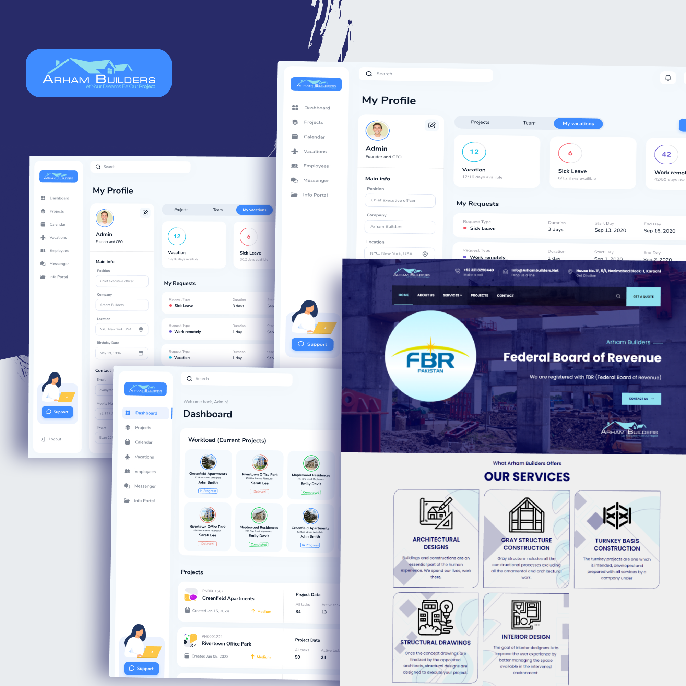

# Arham Builders

Arham Builders' website is designed to provide a comprehensive digital presence for their construction business. The site includes a well-structured landing page and an advanced dashboard to streamline project management. Key features include:

### Modern Landing Page:

- **Engaging Design:** Captivates visitors with a clean, professional layout and high-quality visuals that reflect the company’s expertise in construction.
- **Service Highlights:** Clearly outlines the range of services offered, showcasing completed projects and client testimonials to build trust and credibility.
- **Contact Information:** Easy-to-access contact details and inquiry forms facilitate seamless communication with potential clients.

### Advanced Dashboard:

- **Project Management:** Provides an intuitive interface for managing ongoing construction projects, tracking progress, and updating statuses in real-time.
- **Data Analytics:** Includes tools for generating reports and analyzing project performance, helping teams make informed decisions.
- **Team Collaboration:** Features tools for internal communication and collaboration among project managers, workers, and other stakeholders.
- **Resource Management:** Tracks and manages resources, including labor and materials, to ensure efficient project execution.
The Arham Builders website combines a user-friendly front-end with a powerful back-end dashboard, enhancing both client engagement and project management capabilities.

